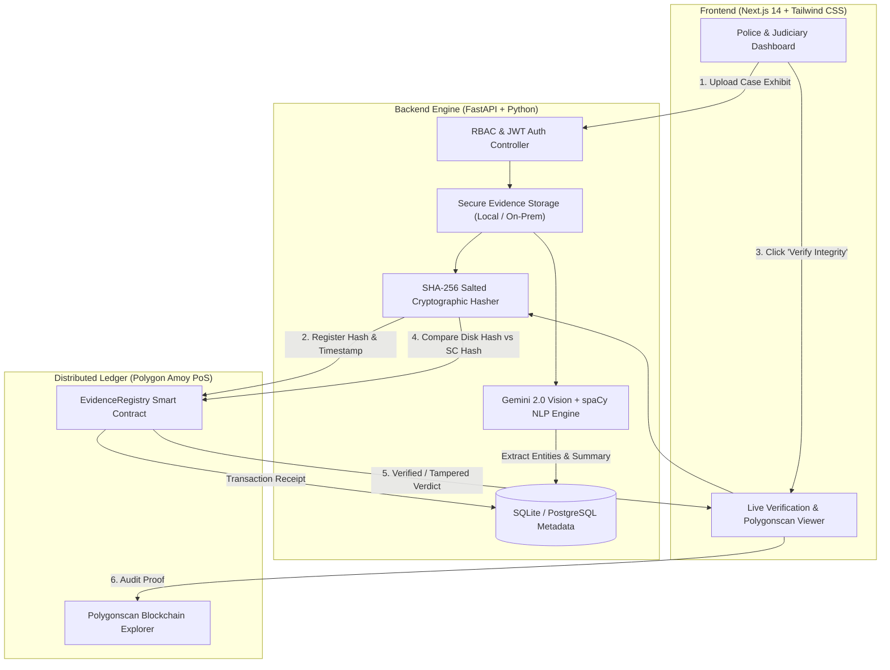

# 🛡️ Blockchain-Based Digital Evidence Management System (DMS)
### Smart India Hackathon 2026 | Problem Statement ID: 26190
**Organization:** Ministry of Home Affairs (MHA)  
**Department:** National Crime Records Bureau (NCRB) / Women Safety Division  
**Category:** Software | **Theme:** Blockchain & Cybersecurity  
**Team:** Parikalp

---

## 📌 Executive Summary

Law enforcement agencies, legal departments, and courts handle thousands of sensitive case exhibits daily—including **FIRs, case diaries, witness statements, forensic reports, CCTV footage, and court judgments**. Traditional paper-based workflows and fragmented cloud/local storage solutions introduce critical vulnerabilities:

- **Evidence Tampering Risks:** Disgruntled actors or rogue administrators can silently alter files or database records without an audit trail.
- **Broken Chain of Custody:** High legal scrutiny under the **Bharatiya Sakshya Adhiniyam (BSA) Section 63** and **Indian Evidence Act (IEA) Section 65B** requires irrefutable cryptographic proof of authenticity for digital evidence in court.
- **Unreadable Handwritten Records:** Indian police records are predominantly handwritten and bilingual (Hindi + English). Conventional OCR software frequently fails or produces incomprehensible output.
- **Lack of Binary Version Control:** Overwriting digital exhibits destroys historical investigative records.

### 💡 The Parikalp Solution
An enterprise-grade, **hybrid decentralized Digital Evidence Locker** that bridges local on-premise document storage with the **Polygon Proof-of-Stake (PoS) Blockchain** and **Google Gemini Multimodal AI**. It guarantees tamper-proof immutability, automated bilingual extraction, and seamless verification for investigating officers and judges.

---

## 🚀 Key Strong Points & Architectural Innovations

### 1. 🔒 Triple-Layer Cryptographic Tamper Detection Engine
Unlike traditional systems that rely solely on database checksums (which any database administrator can manipulate), our system validates document integrity across **three independent layers**:
1. **Layer 1 (Physical File Check):** Computes the live **SHA-256 hash** of the physical file on disk/storage with unique case-salted metadata.
2. **Layer 2 (Database Audit State):** Compares the calculated hash with the internal relational ledger.
3. **Layer 3 (Distributed Public Ledger):** Queries the immutable **Polygon Smart Contract** to confirm the hash recorded at the moment of evidence upload.

> **Tamper Proof in Action:** If an attacker or corrupted administrator modifies even a single byte or space inside an evidence file or directly alters the local database, the live hash deviates from the blockchain ledger, instantly triggering a **🚨 CRITICAL TAMPER ALERT**.

### 2. ⚡ Ultra Gas-Optimized Smart Contract (~50,000 Gas)
- We do **not** store bulky documents on-chain (which is cost-prohibitive and violates privacy laws). Instead, only the cryptographic fingerprint (SHA-256) and case identifier are registered on-chain.
- Custom-engineered Solidity smart contract optimized for minimal gas usage: **~50k gas (approx. 0.003 MATIC per evidence record)**, making it economically viable for nationwide deployment across thousands of police stations.

### 3. 🧠 Multimodal AI & OCR for Indian Law Enforcement
- **The Problem:** 80%+ of Indian police diaries and FIRs contain handwritten cursive text and mixed vernacular scripts (Hinglish/Hindi + English) where legacy OCR tools like Tesseract fail completely.
- **Our Approach:** Integrates **Google Gemini 2.0 Flash Multimodal Vision** with **Tesseract OCR**:
  - Gemini visually interprets handwritten script and bilingual structures with high accuracy.
  - Automatically extracts accused details, witness statements, sections of law (IPC/BNS), and key incident summaries.
  - Generates searchable metadata to enable fast semantic discovery across millions of archived records.

### 4. ⚖️ BSA Section 63 & Indian Evidence Act Section 65B Compliance
- Digital evidence is only admissible in court if its **Chain of Custody** is provably intact.
- Every upload, version update, and viewing action is cryptographically signed, timestamped, and linked to the officer's verified badge and role.
- Generates automated, court-ready **Electronic Evidence Audit Certificates** with live Polygonscan transaction proofs.

### 5. 🗄️ Append-Only Version Control for Binary Evidence
- Evidence files (PDFs, body-cam footage, audio recordings) cannot be diffed like source code.
- Uses an **Append-Only Snapshot Model**: updating a case diary never overwrites the original record; it creates an immutable `v2.0` snapshot, linked cryptographically to `v1.0`, preserving the complete evidentiary timeline.

### 6. 👮 Role-Based Access Control (RBAC)
- Strict separation of duties enforced via **JWT (JSON Web Tokens)**:
  - **Investigating Officer (IO):** Can register cases, upload exhibits, and view assigned cases.
  - **Supervisory Reviewer:** Can review findings, request revisions, and verify integrity.
  - **Judicial Authority (Judge):** Has read-only inspection access and the exclusive authority to **Cryptographically Seal** a case before trial.

---

## 🏗️ System Architecture & Workflow



---

## 💻 Tech Stack

| Component | Technology | Rationale & Responsibility |
|---|---|---|
| **Frontend** | Next.js 14, React, Tailwind CSS, Lucide Icons | Responsive, accessible government-grade dashboard with real-time modal alerts. |
| **Backend API** | FastAPI (Python 3.10+), Uvicorn | High-throughput asynchronous REST API for rapid evidence processing and hashing. |
| **Blockchain** | Polygon Amoy Testnet (Solidity, Web3.py) | High-speed, low-cost EVM Layer-2 for immutable public chain-of-custody logging. |
| **Multimodal AI** | Google Gemini 2.0 Flash Vision | Visual document comprehension for handwritten and bilingual Indian legal FIRs. |
| **Traditional OCR** | Tesseract OCR (`pytesseract`, `pdf2image`) | High-speed local text extraction for typed PDF documents and charge sheets. |
| **Semantic Search** | Scikit-Learn (TF-IDF Vectorizer) + spaCy | Fast, air-gapped natural language search across case files without external cloud leaks. |
| **Database** | SQLite (Prototype) / PostgreSQL (Production) | Normalized schema for case metadata, user credentials, audit logs, and version chains. |
| **Security & Auth** | Passlib (bcrypt), Python-Jose (JWT) | Cryptographic password hashing and tamper-evident bearer tokens for RBAC. |

---

## ⛓️ Live Blockchain Deployment

The smart contract is actively deployed on the **Polygon Amoy Testnet**:

- **Network Name:** Polygon Amoy Testnet
- **Chain ID:** `80002`
- **Smart Contract Address:** [`0x8784D3f0161a3bA1941942748041583b22CE286E`](https://amoy.polygonscan.com/address/0x8784D3f0161a3bA1941942748041583b22CE286E)
- **Active Authority Wallet:** [`0x12577EB26e56dcEa77354155a62b352648fb045b`](https://amoy.polygonscan.com/address/0x12577EB26e56dcEa77354155a62b352648fb045b)
- **Gas per Transaction:** ~50,000 gas (~0.003 MATIC)

---

## ⚡ Quick Start & Installation

### Option 1: One-Click Startup (Windows)
For judges, evaluators, and reviewers on Windows:

1. Clone this repository:
   ```bash
   git clone https://github.com/prathammittal044-eng/sih-evidence-locker-2-.git
   cd sih-evidence-locker-2-
   ```
2. Double-click **`start_windows.bat`**.
3. The script will automatically configure the Python virtual environment, install dependencies, initialize spaCy models, install Node packages, and launch both servers.
4. Access the web dashboard at: **http://localhost:3000**

---

### Option 2: Manual Step-by-Step Setup

#### Prerequisites
- **Node.js:** v18.0 or higher
- **Python:** v3.10 or higher
- **Tesseract OCR (Optional for local OCR):** [UB-Mannheim Installer](https://github.com/UB-Mannheim/tesseract/wiki) (installed to `C:\Program Files\Tesseract-OCR`).

#### 1. Backend Setup
```bash
cd backend

# Create and activate virtual environment
python -m venv .venv
# On Windows:
.venv\Scripts\activate
# On Linux/macOS:
source .venv/bin/activate

# Install Python requirements
pip install -r requirements.txt

# Download NLP model
python -m spacy download en_core_web_md

# Start FastAPI server on port 8000
uvicorn main:app --reload --port 8000
```
Backend API documentation will be available at: **http://localhost:8000/docs**

#### 2. Frontend Setup
```bash
cd frontend

# Install Node dependencies
npm install

# Launch Next.js development server
npm run dev
```
Frontend portal will be live at: **http://localhost:3000**

---

## 🧪 Demo Accounts & Evaluator Testing Guide

### 🔑 Pre-Configured Test Credentials

| Role | Username | Password | Assigned Name & Department |
|---|---|---|---|
| **Investigating Officer** | `sharma` | `Officer@123` | Sub-Inspector Sharma, Cyber Crime Unit |
| **Supervisory Reviewer** | `verma` | `Reviewer@123` | Chief Inspector Verma, Special Branch |
| **Judicial Authority** | `judge1` | `Judge@123` | Hon. Judge Patel, Sessions Court |

---

### 🔬 How to Test the System in 4 Steps

1. **Login & Case Creation:**
   - Log in as Officer `sharma`.
   - Create a new Case (e.g., *FIR 104/2026 - Cyber Financial Fraud*).
2. **AI Document Scanning & Upload:**
   - Upload any sample FIR, document, or image (even handwritten).
   - Watch the system compute the **SHA-256 Salted Hash**, broadcast it to the **Polygon Amoy Blockchain**, and generate an **AI Document Analysis** with entity tags.
3. **Verify Integrity (Legitimate State):**
   - Click the **"Verify Integrity"** button on the document card.
   - Observe the live verification modal query the Polygon smart contract and display a **Green "Verified on Polygon"** status with the corresponding Polygonscan transaction link.
4. **Live Tamper Detection Test (The Acid Test):**
   - Navigate locally to `backend/uploads/` on the server machine.
   - Open any uploaded evidence file in Notepad and add a single space, dot, or character, then save it.
   - Return to the browser and click **"Verify Integrity"**.
   - The system instantly detects that the recomputed physical hash mismatches the immutable blockchain record, displaying a **Red "🚨 CRITICAL TAMPER ALERT"**.

---

## 🏛️ Legal Standards Compliance

| Legal Framework | Compliance Mechanism in Parikalp |
|---|---|
| **Bharatiya Sakshya Adhiniyam (BSA) Section 63** | Digital evidence admissibility established via cryptographic timestamping, automated hash logging, and permanent audit trails. |
| **Indian Evidence Act (IEA) Section 65B** | Electronic record certification verified against an immutable decentralized ledger; guarantees zero post-seizure tampering. |
| **ISO/IEC 27037** | Adheres to international standards for identification, collection, acquisition, and preservation of digital evidence. |

---

## 👥 Team Parikalp
Developed with dedication for the **Smart India Hackathon 2026** to empower Indian Law Enforcement and Judiciary with cutting-edge cybersecurity and decentralized infrastructure.
